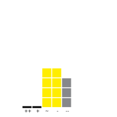
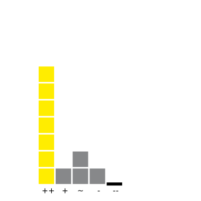

# VisualizeFiveLevelLikertItem
JavaScript library to generate SVG charts for a <a href="https://en.wikipedia.org/wiki/Likert_scale"> five-level Likert item</a>.

The implementation is based on following requirements:
- The chart has to be included in a web page where the size of the chart can be changed easily.
- The chart has to include the distribution of all answers.
- The chart has to show how many answers are given per option and in total.
- The chart has to highlight the most answered option.

In order to meet the requirements following decissions are made:
- To include it in a webpage the JavaScript library d3js is used. To make the char size independent d3js generates SVG charts.
- Each answer is respected by one rectangle.
- To count all given answers the amount of rectangles included in the chart can be counted.
- The most answered option is given by another color.

The range of answers per option is from zero to ten. The options are labeled by:
* Strongly agree = ++
* Agree = + 
* Neither agree nor disagree = ~
* Disagree = -
* Strongly disagree = --

# Example 1:
```javascript
 var rectangleColorMaxAnswerdOption = "#ffed00"; // the color of the rectangles for the most answered option
 var rectangleColorOtherOptions = "#87888a"; // the color of the rectangles for all other options
 ...
 var answersQ1 = [0,0,4,4,3];
```


# Example 2: 
```javascript
 var rectangleColorMaxAnswerdOption = "#ffed00"; // the color of the rectangles for the most answered option
 var rectangleColorOtherOptions = "#87888a"; // the color of the rectangles for all other options
 ...
 var answersQ2 = [7,1,2,1,0]; 
```

